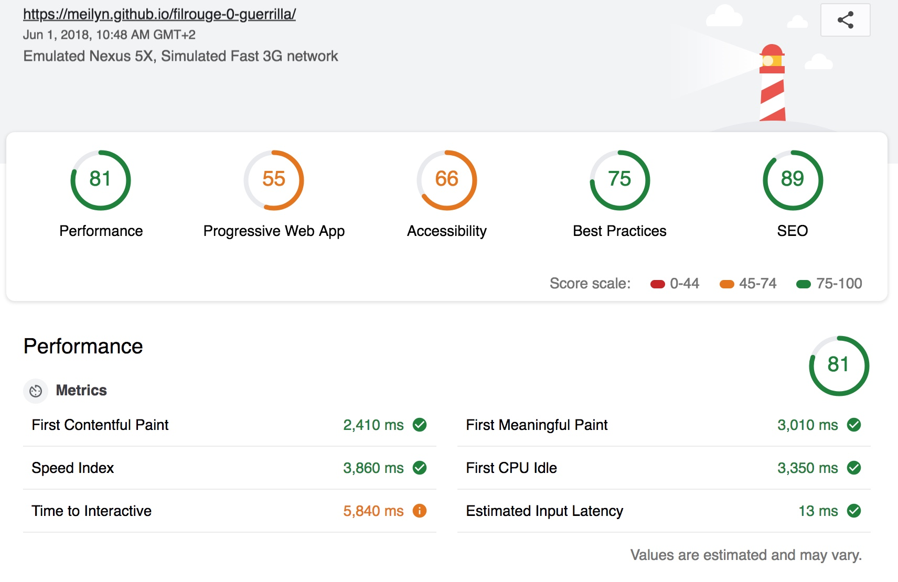

# Les Orphelins de Pondichéry

Les Orphelins de Pondichéry est une organisation non politique, non gouvernementale et non confessionnelle. Elle s’est donnée la mission d’aider les enfants défavorisés de Pondichery (Inde) à trouver une place responsable, autonome et heureuse dans la société indienne.

 

L’association soutient prioritairement les actions à destination des filles et des garçons  les orphelinats situés dans le village de Nonacouppam et Palayam, près de Pondichery (Inde). Depuis 2012, elle prend en charge la construction d’un atelier de couture qui sera ouvert aux enfants et aux femmes du village et participe à l’éducation des enfants d’orphelinat.

### MISSION
 
* Création d'un one-pager pour l'association **Les Orphelins de Pondichéry**. 
* **Délai**: 6 hours
* **Date:** 31/05/2018
* **Réalisé par:** Meilyn ANDRADE 

### SOURCES
* Website: AUCUN.
* [Facebook](https://bit.ly/2J7sQK3)
* [Blog](https://orphelinsdepondichery.jimdo.com/don-et-adhesion/)
* Résultat: [Les Orphelins de Pondichéry](https://meilyn.github.io/filrouge-0-guerrilla/) 

### OBJECTIVES
* Réaliser un one-pager.
* Choisir une template sur html5up.net (ou autre)
* Le modifier en utilisant le contenu rassemblé
* Une fois publié, utiliser le Lighthouse Test et améliore le code pour améliorer ses scores dans tous les domaines.
* Si possible, trouve un nom de domaine gratuit
*Publier le résultat sur ce formulaire avant la fin de la deadline.

### Outils

* [html5up.net](https://html5up.net/)
* [Lighthouse](https://developers.google.com/web/tools/lighthouse/) 
* [SublimeText] (https://www.sublimetext.com/)

### TEST LIGHTHOUSE
(1er Test)

